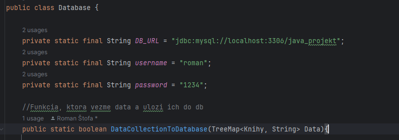
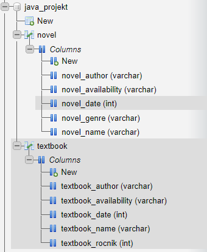

# Java Project
## Contributors
### Roman Štofa [GIT](https://github.com/Karelabiss)
### Dominik Šrenk [GIT](https://github.com/domo220)

## Databáza
Databáza bola vypracovaná na základe pripojenia k externému serveru a nie do súboru.

V našom prípade ide o MySQL server na localhoste pomocou aplikácie XAMPP.

Ako connection string tak aj prihlasovacie údaje sú špecifikované na začiatku metódy Database.java.

> Databáza obsahuje dve tabuľky "textbook" a "novel". Tie sa nachádzajú v databáze s menom "java_projekt".

Daná databáza obsahuje 2 tabuľky:

- textbook
- novel

Tabuľka "novel" obsajuje polia:

|     **Stĺpec**     | **Typ** | **dĺžka** |
|:------------------:|:-------:|:---------:|
|     novel_name     | VARCHAR |    100    |  
|    novel_author    | VARCHAR |    100    | 
| novel_availability | VARCHAR |    100    |  
|     novel_date     |   INT   |    255    | 
|    novel_genre     | VARCHAR |    100    |

Tabuľka "textbook" obsajuje polia:

|      **Stĺpec**       | **Typ** | **dĺžka** |
|:---------------------:|:-------:|:---------:|
|     textbook_name     | VARCHAR |    100    |  
|    textbook_author    | VARCHAR |    100    | 
| textbook_availability | VARCHAR |    100    |  
|     textbook_date     |   INT   |    255    | 
|    textbook_rocnik    |   INT   |    32     |

